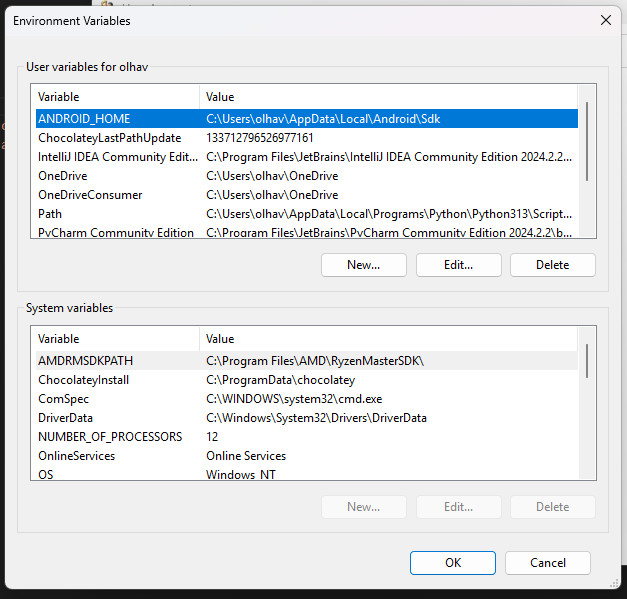

# thebrownbottle
<div align="center">
    >
</div>

### CS4800 Research 
#### Student Researchers: Dominick Olhava, Ishimwe Gentil, Aaryn Warrior
#### Faculty Advisor: Dr. Andrew Berns


## Installing React Native 

### Initial Dependencies
Follow steps [HERE](https://reactnative.dev/docs/set-up-your-environment) for installing:
1. Node.js
2. JDK
3. Android Studio
4. Android System ENV Variables and PATH

### Windows ENV and PATH Configuration
<div align="center">
    <p>Update ENV Variables to <b>ANDROID_HOME</b></p>
    
    <p>Add PATH: <b>C:\Users\<usernmame>\AppData\Local\Android\Sdk\platform-tools</b></p>
    
</div>

### Creating React Native Project
1. Go to the directory where you want to create a new React Native Project
```bash
npm install --save-dev @react-native-community/cli 
npx @react-native-community/cli init <project-name> # Creates a new React Native Project in a folder within the current directory
```

2. If you already have a React Native project and are **cloning** from a Git Repo run the following command **IN** the directory that contains the React Native Project files:
```bash
npm install
```

3. React Native Commands
```bash
npx react-native start # Starts Metro bundler (not used too often)

npx react-native run-android # Starts android code compilation. 
#Must have an active Android Studio avd (emulated device) running or physical device connected so that the app can render

npx react-native run-ios # Starts ios compilation. Runs app on ios device.

npx react-native start --reset-cache # Resets build cache. Good to use when there are build errors.

```

### Android Studio AVD Setup

<div align="center">
    <p>Open the dropdown and select <b>Virtual Device Manager</b></p>
    
    <p>Add a new AVD with the <b>+</b> or press the <b>triangle</b> to run an existing emulation</p>
    
</div>